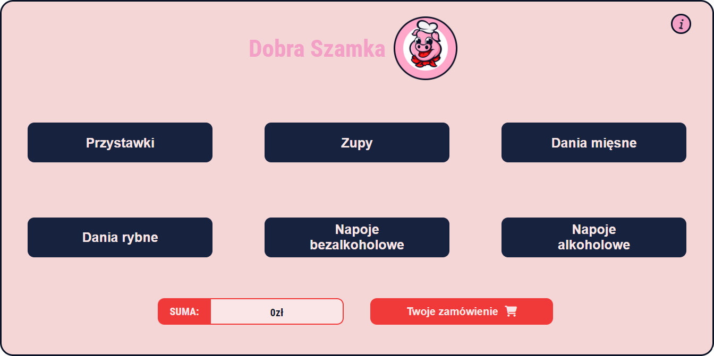
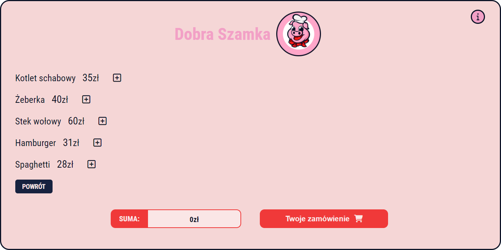
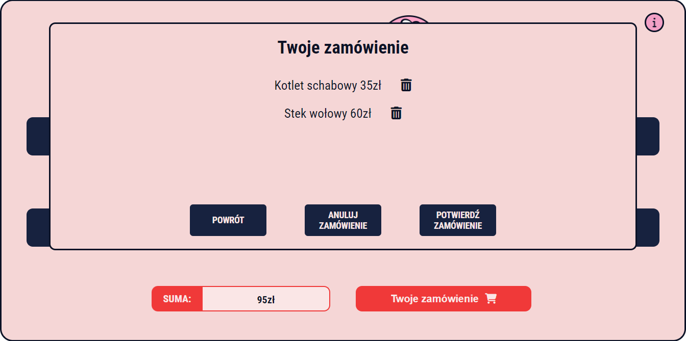
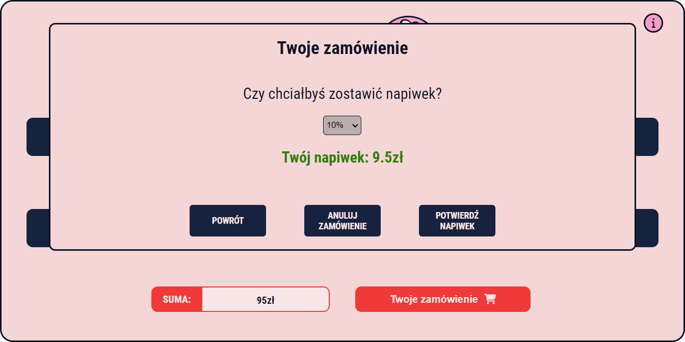

# Food Ordering App

Order what you want and see how easy it is.

https://tom-kola.github.io/FoodOrderingApp/

## The goal

This app was made to improve my JavaScript skills.

## What next about the app?

My next goal is to make this app responsive.

## Built with

<ul>
<li>HTML</li>
<li>CSS</li>
<li>JavaScript</li>
</ul>

## Features
 <ul>
 <li>Current price in real time</li>
 <li>Shopping cart content</li>
 <li>Tips</li>
 <li>Possibility to add and remove meals and drinks</li>
 </ul>

 ## Project screenshots

### Main view
 

### Dish view
 

### Shopping cart view
 

### Tip view
 
 